# AWS Identity and Access Management

```mermaid
%%{init: {'theme': 'base', 'themeVariables': { 'primaryColor': '#FF6B6B', 'primaryTextColor': '#fff', 'primaryBorderColor': '#2C3E50', 'lineColor': '#2C3E50', 'secondaryColor': '#4ECDC4', 'tertiaryColor': '#45B7D1', 'fontFamily': 'Inter, sans-serif', 'fontSize': '14px'}}}%%

flowchart TB
    subgraph mgmt[" "]
        direction TB
        M["Management Account (Root)<br/>AWS Organizations | SCPs | Billing"]
    end

    subgraph ous["Organizational Units"]
        direction LR

        subgraph sec_ou["Security OU"]
            direction TB
            SEC1["• Log Archive Account"]
            SEC2["• Audit Account"]
            SEC3["• IAM Identity Center"]
        end

        subgraph inf_ou["Infrastructure OU"]
            direction TB
            INF1["• Shared Services Account"]
            INF2["• Networking | DNS"]
            INF3["• Terraform State S3 | DynamoDB"]
        end

        subgraph work_ou["Workloads OU"]
            direction TB
            W1["• Production Account"]
            W2["• Staging Account"]
            W3["• Development Account"]
        end
    end

    subgraph tools["Automation & Access Layer"]
        direction LR

        subgraph github["GitHub Actions"]
            direction TB
            G1["OIDC Token Exchange"]
            G2["Temporary Credentials"]
            G3["No Static Secrets"]
        end

        subgraph tf["Terraform Modules"]
            direction TB
            T1["• iam-account (password policy)"]
            T2["• iam-oidc-provider (GitHub)"]
            T3["• iam-role (assume role policies)"]
        end

        subgraph sso["IAM Identity Center (SSO)"]
            direction TB
            S1["• Human User Access"]
            S2["• Permission Sets per Environment"]
            S3["• Automatic Role Assumption"]
        end
    end

    subgraph controls["Security Controls Layer"]
        direction LR
        C1["• CloudTrail (Organization Trail)"]
        C2["• CloudWatch Logs"]
        C3["• SCPs (Deny Root, Region Lock)"]
        C4["• KMS Encryption"]
        C5["• AWS Config Rules"]
        C6["• GuardDuty"]
    end

    %% Management to OU relationships (solid arrows)
    M -->|"Manages"| sec_ou
    M -->|"Manages"| inf_ou
    M -->|"Manages"| work_ou

    %% Tools to OU relationships (dashed arrows)
    github -->|"Deploys to"| sec_ou
    tf -->|"Provisions"| inf_ou
    sso -->|"Authenticates to"| work_ou

    %% Security controls enforcement (dotted/red arrows)
    controls -.->|"Enforces"| ous

    %% Styling with fill colors
    style M fill:#FF6B6B,stroke:#2C3E50,stroke-width:3px,color:#fff
    style mgmt fill:#FF6B6B,stroke:#2C3E50,stroke-width:2px,color:#fff

    style sec_ou fill:#4ECDC4,stroke:#2C3E50,stroke-width:2px,color:#2C3E50
    style inf_ou fill:#96CEB4,stroke:#2C3E50,stroke-width:2px,color:#2C3E50
    style work_ou fill:#45B7D1,stroke:#2C3E50,stroke-width:2px,color:#2C3E50

    style github fill:#6C5CE7,stroke:#2C3E50,stroke-width:2px,color:#fff
    style tf fill:#F7B731,stroke:#2C3E50,stroke-width:2px,color:#2C3E50
    style sso fill:#FD79A8,stroke:#2C3E50,stroke-width:2px,color:#fff

    style controls fill:#E17055,stroke:#2C3E50,stroke-width:2px,color:#2C3E50,opacity:0.3

    style M color:#fff
    style G1 color:#fff
    style G2 color:#fff
    style G3 color:#fff
    style S1 color:#fff
    style S2 color:#fff
    style S3 color:#fff

    %% Link styling
    linkStyle 0 stroke:#2C3E50,stroke-width:2px
    linkStyle 1 stroke:#2C3E50,stroke-width:2px
    linkStyle 2 stroke:#2C3E50,stroke-width:2px
    linkStyle 3 stroke:#2C3E50,stroke-width:1.5px,stroke-dasharray: 5 5
    linkStyle 4 stroke:#2C3E50,stroke-width:1.5px,stroke-dasharray: 5 5
    linkStyle 5 stroke:#2C3E50,stroke-width:1.5px,stroke-dasharray: 5 5
    linkStyle 6 stroke:#E17055,stroke-width:2px,stroke-dasharray: 3 3
```

## Architecture Legend
| Symbol    | Meaning                                         |
| --------- | ----------------------------------------------- |
| **——→**   | Direct Management (Management Account → OU)     |
| **- - →** | Provisioning / Deployment (Tools → Accounts)    |
| **···→**  | Security Enforcement (Controls Layer → All OUs) |

## Component Descriptions
### Management Account (Root)
The foundation of the AWS Organization. This account should **never run workloads**;it exists solely for organization management, billing consolidation, and SCP administration. All API calls made by the root user in this account trigger immediate security alerts.

### Security OU
Hosts accounts dedicated to security operations:
- **Log Archive**: Immutable storage for CloudTrail logs from all accounts
- **Audit**: Read-only security investigations without touching production resources
- **IAM Identity Center**: Centralized user authentication and SSO

### Infrastructure OU
Hosts shared infrastructure services:
- **Shared Services**: Cross-cutting services (DNS, directory, container registries)
- **Networking | DNS**: VPC sharing, Transit Gateway, Route53 management
- **Terraform State S3 | DynamoDB**: Centralized remote state storage with locking

### Workloads OU
Hosts application environments with hard isolation boundaries:
- **Production**: Customer-facing workloads with strictest security controls
- **Staging**: Pre-production testing with realistic data (anonymized)
- **Development**: Developer experimentation with cost and security guardrails

### GitHub Actions
CI/CD automation using **OIDC federation**; no long-lived AWS credentials are stored anywhere. Each workflow run receives temporary credentials valid for the duration of the job only.

### Terraform Modules
Five reusable modules that compose into environment-specific configurations:
1. `iam-account`: Root lockdown, password policy, account alias
2. `iam-oidc-provider`: OpenID Connect federation (GitHub, corporate IdP)
3. `iam-role`: Assumable roles with condition-based trust policies
4. `organizations`: OU structure, SCPs, account factory
5. `cloudtrail`: Audit logging, log archival, encryption

### IAM Identity Center (SSO)
Replacement for IAM users across all accounts. Human engineers authenticate once through the corporate identity provider and receive temporary credentials for any assigned account. No access keys, no passwords, immediate offboarding.

### Security Controls Layer
Foundational guardrails enforced across all accounts:
- **CloudTrail (Organization Trail)**: Logs every API call from every account
- **CloudWatch Logs**: Real-time log streaming and alerting
- **SCPs**: Service Control Policies that deny root access, lock regions, require encryption
- **KMS Encryption**: Customer-managed keys for log and state encryption
- **AWS Config Rules**: Continuous compliance monitoring
- **GuardDuty**: Intelligent threat detection using ML