# Production Ready AWS IAM and Identity Infrastructure Guidance

## Metadata
- `created-at-date:` `06-07-2026`
- `created-by`: `Renaldas Jakas`
- `version`: `1.0`
- `last-updated-date`: `06-07-2026`
- `last-updated-by`: `Renaldas Jakas`

## Introduction
GitHub-hosted runners combined with **OIDC authentication are the recommended and more secure approach** for most use cases; they eliminate all long-lived credentials entirely.
EC2 self-hosted runners are **not required for security** and in fact shift significant operational burden to you unless you specifically need VPC-private resource access, GPU builds, or compliance requirements that mandate data residency.

The authentication flow works via **OpenID Connect (OIDC) federation**: GitHub's OIDC provider issues a short-lived signed JWT token for each workflow run, AWS validates this token against a pre-configured IAM OIDC identity provider, and exchanges it for temporary STS credentials scoped to a specific IAM role; no access keys are ever stored or transmitted.

Core Terraform modules for enabling production ready AWS IAM:
- `iam-account` (root lockdown and password policy)
- `iam-oidc-provider` (GitHub federation)
- `iam-role` (assume-role policies for CI/CD and human access)
- `organizations` (multi-account structure and SCPs)
- `cloudtrail` (audit logging)

These modules compose into environment-specific configurations that enforce least privilege from the start.

Reference: [(Github)](https://github.com/aws-actions/configure-aws-credentials) 

## 0. Executive Architecture Overview
The architecture follows a **defense-in-depth strategy** with multiple independent security layers:
- root account protection at the foundation
- multi-account isolation through AWS Organizations
- identity federation through IAM Identity Center
- keyless CI/CD through OIDC
- comprehensive audit logging through CloudTrail
- guardrails through Service Control Policies

No single layer is trusted alone; each provides redundancy and backup protection if another layer fails.

The key design principle throughout this architecture is **never store long-lived credentials**. 
Every authentication path; whether for human engineers, CI/CD pipelines, or service-to-service communication, uses temporary credentials with automatic expiration. 

This eliminates the largest class of AWS security incidents: 
- credential leakage through code commit log files, environment variables, or compromised developer machines. 

The OIDC-based GitHub Actions integration exemplifies this principle: no AWS access keys exist anywhere in the GitHub ecosystem, yet pipelines have fully authenticated, least-privilege access to AWS resources. 

Reference: [(Github)](https://github.com/aws-actions/configure-aws-credentials) 

### 0.1 Architecture Diagram

```mermaid
%%{init: {'theme': 'base', 'themeVariables': { 'primaryColor': '#FF6B6B', 'primaryTextColor': '#fff', 'primaryBorderColor': '#2C3E50', 'lineColor': '#2C3E50', 'secondaryColor': '#4ECDC4', 'tertiaryColor': '#45B7D1', 'fontFamily': 'Inter, sans-serif', 'fontSize': '14px'}}}%%

flowchart TB
    subgraph mgmt[" "]
        direction TB
        M["Management Account (Root)<br/>AWS Organizations | SCPs | Billing"]
    end

    subgraph ous["Organizational Units"]
        direction LR

        subgraph sec_ou["Security OU"]
            direction TB
            SEC1["• Log Archive Account"]
            SEC2["• Audit Account"]
            SEC3["• IAM Identity Center"]
        end

        subgraph inf_ou["Infrastructure OU"]
            direction TB
            INF1["• Shared Services Account"]
            INF2["• Networking | DNS"]
            INF3["• Terraform State S3 | DynamoDB"]
        end

        subgraph work_ou["Workloads OU"]
            direction TB
            W1["• Production Account"]
            W2["• Staging Account"]
            W3["• Development Account"]
        end
    end

    subgraph tools["Automation & Access Layer"]
        direction LR

        subgraph github["GitHub Actions"]
            direction TB
            G1["OIDC Token Exchange"]
            G2["Temporary Credentials"]
            G3["No Static Secrets"]
        end

        subgraph tf["Terraform Modules"]
            direction TB
            T1["• iam-account (password policy)"]
            T2["• iam-oidc-provider (GitHub)"]
            T3["• iam-role (assume role policies)"]
        end

        subgraph sso["IAM Identity Center (SSO)"]
            direction TB
            S1["• Human User Access"]
            S2["• Permission Sets per Environment"]
            S3["• Automatic Role Assumption"]
        end
    end

    subgraph controls["Security Controls Layer"]
        direction LR
        C1["• CloudTrail (Organization Trail)"]
        C2["• CloudWatch Logs"]
        C3["• SCPs (Deny Root, Region Lock)"]
        C4["• KMS Encryption"]
        C5["• AWS Config Rules"]
        C6["• GuardDuty"]
    end

    %% Management to OU relationships (solid arrows)
    M -->|"Manages"| sec_ou
    M -->|"Manages"| inf_ou
    M -->|"Manages"| work_ou

    %% Tools to OU relationships (dashed arrows)
    github -->|"Deploys to"| sec_ou
    tf -->|"Provisions"| inf_ou
    sso -->|"Authenticates to"| work_ou

    %% Security controls enforcement (dotted/red arrows)
    controls -.->|"Enforces"| ous

    %% Styling with fill colors
    style M fill:#FF6B6B,stroke:#2C3E50,stroke-width:3px,color:#fff
    style mgmt fill:#FF6B6B,stroke:#2C3E50,stroke-width:2px,color:#fff

    style sec_ou fill:#4ECDC4,stroke:#2C3E50,stroke-width:2px,color:#2C3E50
    style inf_ou fill:#96CEB4,stroke:#2C3E50,stroke-width:2px,color:#2C3E50
    style work_ou fill:#45B7D1,stroke:#2C3E50,stroke-width:2px,color:#2C3E50

    style github fill:#6C5CE7,stroke:#2C3E50,stroke-width:2px,color:#fff
    style tf fill:#F7B731,stroke:#2C3E50,stroke-width:2px,color:#2C3E50
    style sso fill:#FD79A8,stroke:#2C3E50,stroke-width:2px,color:#fff

    style controls fill:#E17055,stroke:#2C3E50,stroke-width:2px,color:#2C3E50,opacity:0.3

    style M color:#fff
    style G1 color:#fff
    style G2 color:#fff
    style G3 color:#fff
    style S1 color:#fff
    style S2 color:#fff
    style S3 color:#fff

    %% Link styling
    linkStyle 0 stroke:#2C3E50,stroke-width:2px
    linkStyle 1 stroke:#2C3E50,stroke-width:2px
    linkStyle 2 stroke:#2C3E50,stroke-width:2px
    linkStyle 3 stroke:#2C3E50,stroke-width:1.5px,stroke-dasharray: 5 5
    linkStyle 4 stroke:#2C3E50,stroke-width:1.5px,stroke-dasharray: 5 5
    linkStyle 5 stroke:#2C3E50,stroke-width:1.5px,stroke-dasharray: 5 5
    linkStyle 6 stroke:#E17055,stroke-width:2px,stroke-dasharray: 3 3
```



### 0.2 Architecture Legend

| Symbol    | Meaning                                         |
| --------- | ----------------------------------------------- |
| **->**    | Direct Management (Management Account → OU)     |
| **- - →** | Provisioning / Deployment (Tools → Accounts)    |
| **···→**  | Security Enforcement (Controls Layer → All OUs) |

### 0.3 Component Descriptions

#### Management Account (Root)
The foundation of the AWS Organization. This account should **never run workloads**; it exists solely for organization management, billing consolidation, and SCP administration. All API calls made by the root user in this account trigger immediate security alerts.

#### Security OU
Hosts accounts dedicated to security operations:
- **Log Archive**: Immutable storage for CloudTrail logs from all accounts
- **Audit**: Read-only security investigations without touching production resources
- **IAM Identity Center**: Centralized user authentication and SSO

#### Infrastructure OU
Hosts shared infrastructure services:
- **Shared Services**: Cross-cutting services (DNS, directory, container registries)
- **Networking | DNS**: VPC sharing, Transit Gateway, Route53 management
- **Terraform State S3 | DynamoDB**: Centralized remote state storage with locking

#### Workloads OU
Hosts application environments with hard isolation boundaries:
- **Production**: Customer-facing workloads with strictest security controls
- **Staging**: Pre-production testing with realistic data (anonymized)
- **Development**: Developer experimentation with cost and security guardrails

#### GitHub Actions
CI/CD automation using **OIDC federation**; no long-lived AWS credentials are stored anywhere. Each workflow run receives temporary credentials valid for the duration of the job only.

#### Terraform Modules
Five reusable modules that compose into environment-specific configurations:
1. `iam-account`: Root lockdown, password policy, account alias
2. `iam-oidc-provider`: OpenID Connect federation (GitHub, corporate IdP)
3. `iam-role`: Assumable roles with condition-based trust policies
4. `organizations`: OU structure, SCPs, account factory
5. `cloudtrail`: Audit logging, log archival, encryption

#### IAM Identity Center (SSO)
Replacement for IAM users across all accounts. Human engineers authenticate once through the corporate identity provider and receive temporary credentials for any assigned account. No access keys, no passwords, immediate offboarding.

#### Security Controls Layer
Foundational guardrails enforced across all accounts:
- **CloudTrail (Organization Trail)**: Logs every API call from every account
- **CloudWatch Logs**: Real-time log streaming and alerting
- **SCPs**: Service Control Policies that deny root access, lock regions, require encryption
- **KMS Encryption**: Customer-managed keys for log and state encryption
- **AWS Config Rules**: Continuous compliance monitoring
- **GuardDuty**: Intelligent threat detection using ML

## 1. AWS Root Account Security: The Foundation of Everything

The AWS root account represents the ultimate authority in your AWS environment, it has unrestricted access to all resources and cannot be constrained by IAM policies, SCPs, or permission boundaries. 
This makes root account protection the single most critical security task when establishing a new AWS organization. 
The first principle is **radical minimalism**: the root account should never be used for day-to-day operations, programmatic access, or automated workflows. 
Every AWS security guide, including AWS's own Well-Architected Framework, emphasizes that root credentials should be treated as "break glass" emergency access only.

The immediate lockdown process follows a strict sequence:
**First**, you must **delete all programmatic access keys** associated with the root user. If any access keys exist, whether active or inactive, they represent a direct attack path that bypasses every other security control. 
These keys are often created inadvertently during initial account setup or by following outdated tutorials. After key deletion, you must **enable multi-factor authentication (MFA)** using a hardware MFA device (not a virtual MFA on a phone) for the root account. 
Hardware MFA devices like YubiKeys provide stronger protection against phishing and SIM-swapping attacks compared to software-based TOTP generators. The MFA device should be stored in a physical safe or secure location *accessible only to senior infrastructure leadership*.

Next, configure a **strong password policy** that enforces a minimum of 24 characters with complexity requirements including uppercase, lowercase, numbers, and symbols. 
The password should be generated by a cryptographically secure password manager and rotated every 90 days maximum. 
Critically, this password must never be shared via email, chat, or any digital communication channel. Organizations should establish a formal process for root credential access: a written request approved by two senior stakeholders, credential retrieval from a physical safe, MFA device checkout with chain-of-custody logging, and immediate password reset after use. This process ensures that root access is always deliberate, documented, and time-bounded. 

### 1.2 Terraform Module: iam-account

The `iam-account` module from the official `terraform-aws-modules/iam` collection provides a production-ready implementation for root account hardening and password policy enforcement. 
This module should be applied exactly once per AWS account immediately after account creation, before any other infrastructure is provisioned. 
The module encapsulates account alias configuration (which prevents phishing attacks using lookalike account IDs) and comprehensive password policy settings that enforce organizational security standards.

The module's design follows the principle that **account-level settings are fundamentally different from identity-level settings** and deserve their own abstraction. 
While you could inline these resources directly in your root module, encapsulating them provides version-controlled, reusable configuration that can be consistently applied across dozens of accounts in an organization. 
The account alias is particularly important: it replaces the numeric 12-digit account ID with a human-readable name (like `mycompany-production`) in the AWS console URL, making phishing attacks significantly harder since attackers would need to guess both the alias and credentials rather than just targeting a known account ID.

The password policy configuration enforces modern security standards: a **minimum 24-character password length** (longer passwords are exponentially harder to crack than complex short passwords), character diversity requirements, password history to prevent reuse of the last 3 passwords, and mandatory 90-day rotation cycles. 
These settings apply organization-wide to all IAM users in the account, ensuring consistent security posture. 
Importantly, this module should be combined with SCPs that prevent IAM users from modifying the password policy themselves, creating an administrative control that cannot be overridden by account administrators. 

Reference: [(Github)](https://github.com/terraform-aws-modules/terraform-aws-iam) 

### 1.3 Root Account Monitoring and Alerting

Beyond initial hardening, the root account requires **continuous monitoring** through CloudTrail and EventBridge. 
Every API call made by the root user should trigger immediate high-priority alerts to the security team via SNS to Email/Slack/PagerDuty. This monitoring is non-negotiable because root account usage should be so rare that any instance warrants immediate investigation. The CloudTrail organization trail (discussed in Section 8) captures all root account activity across every account in your organization, providing centralized visibility. 

EventBridge rules should be configured to detect specific root account events: `ConsoleLogin` (any root console access), `CreateAccessKey` (attempts to create root access keys), `DeleteAccountPasswordPolicy` (attempts to weaken password requirements), and `PutBucketPolicy` with public access (root-level S3 exposure). 
These rules should trigger automated incident response workflows that page the on-call security engineer. 
The combination of SCPs that block most root actions, MFA requirements, and real-time alerting creates a defense-in-depth strategy where root compromise requires bypassing multiple independent controls. 

### 1.4 Root Account Contact and Recovery Information

A frequently overlooked aspect of root account security is maintaining accurate contact information. The root account email address should be a **dedicated, monitored mailbox** (e.g., `aws-root@company.com`) accessible to multiple senior infrastructure leaders, not an individual employee's email that becomes inaccessible when they leave the organization. 
AWS sends critical security notifications, billing alerts, and account recovery instructions exclusively to this email address, this means losing access to it can result in permanent account lockout. 

The root account should have a **dedicated phone number** for MFA recovery and emergency access. 
This should be a company-controlled number that routes to an on-call rotation, not a personal mobile phone. Additionally, the alternate contacts (Billing, Operations, Security) should be configured with team distribution lists rather than individual emails. 
These contacts receive different types of AWS notifications: Billing contacts receive invoice and payment alerts, Operations contacts receive service health notifications, and Security contacts receive vulnerability and incident reports. 
Configuring these alternate contacts ensures that critical notifications reach the appropriate team even if the root email owner is unavailable.

## 2. Multi-Account Architecture with AWS Organizations
### 2.1 The Case for Multi-Account Strategy

Running all workloads in a single AWS account is the most common infrastructure mistake organizations make, and it creates a fundamental security boundary problem that no amount of IAM policy refinement can fully solve. 
When development, staging, and production environments share an account, a misconfigured IAM policy in a dev environment can expose production data. 
A runaway Lambda function in staging can exhaust account-wide service quotas and cascade into production outages. 
A compromised developer credential with broad permissions can access customer data across all environments. 
**AWS Organizations with a multi-account strategy eliminates these blast radius risks by providing hard isolation boundaries between workloads.** 

The AWS Organizations service enables you to create a hierarchical tree of accounts with centralized billing, consolidated CloudTrail logging, and governance through Service Control Policies. 
The recommended structure follows the AWS Well-Architected Framework and consists of a Management account at the root (used only for organization management, never for workloads), Organizational Units (OUs) that group accounts by function, and member accounts that host actual workloads. 
This structure is often called a **Landing Zone**: a pre-configured, secure, multi-account environment that serves as the foundation for all cloud operations. 

### 2.2 Recommended OU and Account Structure

The standard production landing zone architecture organizes accounts into four primary Organizational Units. 
The **Security OU** contains the Log Archive account (which stores immutable CloudTrail logs from all accounts) and the Audit account (where security teams perform investigations without touching production resources). 
The **Infrastructure OU** contains the Shared Services account, which hosts cross-cutting infrastructure like DNS, directory services, and the Terraform state backend (S3 bucket and DynamoDB lock table). 
The **Workloads OU** is subdivided into Production and Non-Production sub-OUs, containing the actual application workload accounts. 
Finally, a **Sandbox OU** provides isolated experimentation environments for developers. 

| OU | Accounts | Purpose | SCP Guardrails |
|---|---|---|---|
| **Security** | Log Archive, Audit | Centralized logging, security investigations | Deny all modifications to CloudTrail, GuardDuty, Config |
| **Infrastructure** | Shared Services | Terraform state, DNS, VPC sharing | Require encryption on all resources, restrict to approved regions |
| **Workloads** | Production, Staging, Dev | Application workloads | Deny root user actions, require MFA for privileged roles, block public S3 |
| **Sandbox** | Individual dev accounts | Experimentation, learning | Deny access to production data sources, limit instance sizes, block RDS deletion |

Each account should be created with a **unique email address** using the plus-addressing trick (e.g., `aws+production@company.com`, `aws+staging@company.com`) so all notifications route to a central mailbox while AWS treats them as distinct accounts. 
This pattern simplifies account management while maintaining clear ownership boundaries.

### 2.3 Terraform Implementation: organizations Module

The organizations module serves as the foundational Terraform configuration that must be applied from the Management account. 
This module creates the OU hierarchy, provisions member accounts, and attaches SCPs to enforce security guardrails. 
The implementation requires careful bootstrapping because Terraform itself needs permissions to create accounts and manage the organization, a classic chicken-and-egg problem that is solved by creating a dedicated `TerraformAdmin` IAM user in the Management account with scoped `organizations:*` permissions for the initial run, then transitioning to role-based access. 

The module structure follows a **hierarchical composition pattern**: the root module defines the organizational structure (OUs and accounts), while nested modules handle SCP definitions, account creation with proper email addressing, and cross-account role trust relationships. 
Account creation via Terraform is asynchronous, the `aws_organizations_account` resource may take several minutes to complete as AWS provisions the new account infrastructure. 
The module must handle this gracefully with proper `depends_on` chains and output values that capture the newly created account IDs for downstream module consumption. 

After account creation, the module establishes **cross-account trust relationships** by creating `OrganizationAccountAccessRole` in each member account with a trust policy that allows assumption from the Management account. 
This role serves as the initial entry point for Terraform to provision resources in member accounts. 
In production, this broad role should be replaced with more specific roles following the principle of least privilege, for example, a `TerraformNetworkRole` in the Shared Services account that only has VPC and networking permissions. 

## 3. Terraform Module Architecture for IAM Infrastructure
### 3.1 The Five Core IAM Modules

Based on production patterns from the `terraform-aws-modules/iam` ecosystem and enterprise implementations, a production-ready IAM infrastructure requires **five interconnected Terraform modules** that together provide complete identity and access management. 
These modules follow a layered architecture where lower-level modules (account settings, OIDC providers) are consumed by higher-level modules (roles, policies), which are then composed into environment-specific configurations. 
This separation of concerns enables independent testing, versioning, and reuse across multiple accounts and teams. 

The **iam-account module** (Section 1.2) handles root-level account settings: alias, password policy, and account-level hardening. 
The **iam-oidc-provider module** creates and manages OpenID Connect identity providers for federated authentication, most critically, the GitHub OIDC provider that enables keyless CI/CD authentication. The **iam-role module** is the most heavily used module, creating IAM roles with carefully scoped trust policies that define which principals (users, services, or federated identities) can assume them under what conditions. 
The **organizations module** (Section 2.3) establishes the multi-account structure and SCPs. 
Finally, the **cloudtrail module** configures comprehensive audit logging across all accounts. 

### 3.2 Module: iam-oidc-provider

The `iam-oidc-provider` module creates the critical trust link between external identity providers and AWS. 
For GitHub Actions CI/CD, this module configures an OIDC provider with the URL `https://token.actions.githubusercontent.com` and client ID `sts.amazonaws.com`. 
This provider is a **global resource within an AWS account**, you create exactly one GitHub OIDC provider per account, and then multiple IAM roles can trust it with different subject filters. 
The module also handles the certificate thumbprint validation that AWS requires to verify GitHub's identity tokens. 

The thumbprint is a *SHA-1 hash of the root CA certificate* that signs GitHub's OIDC tokens. 
While AWS documentation provides the current thumbprint, it can change if GitHub rotates their certificates. 
The module should parameterize this value and include validation rules to detect thumbprint mismatches. Some advanced implementations use a data source to dynamically fetch the thumbprint from GitHub's JWKS endpoint, though this introduces an external dependency during Terraform planning. 
The conservative approach is to pin the thumbprint as a variable and update it through a formal change process when needed. 

After creating the OIDC provider, the module outputs the provider ARN, which is consumed by the `iam-role` module to create roles that trust GitHub Actions. 
This output-input chain between modules enforces the correct dependency order and ensures that roles cannot be created before their trusted OIDC provider exists. 
The pattern extends naturally to multiple OIDC providers, you might also create separate providers for GitHub, GitLab, and an internal corporate identity provider, each managed by its own module instance. 

### 3.3 Module: iam-role

The `iam-role` module is the workhorse of IAM infrastructure, responsible for creating roles with precisely defined trust relationships and permission sets. 
This module implements **condition-based trust policies** that restrict which specific repositories, branches, environments, and even pull request authors can assume a given role. 
For GitHub Actions integration, the module uses the `StringLike` condition on the `sub` (subject) claim to match repository patterns like `repo:myorg/my-repo:ref:refs/heads/main`. 

Reference: [(https://github.com/terraform-aws-modules/terraform-aws-iam)](https://github.com/terraform-aws-modules/terraform-aws-iam) 

The module's interface exposes three critical security parameters: `oidc_subjects` (which repositories/branches can assume the role), `oidc_audience` (typically `sts.amazonaws.com` to prevent token replay attacks), and `max_session_duration` (which should be set to the minimum viable time, often 1 hour for CI/CD, to limit the window of exposure if credentials are leaked). 
The trust policy generated by the module follows AWS security best practices by combining multiple conditions: the audience check ensures tokens are intended for AWS, the subject check restricts to specific repos, and an optional `ForAnyValue:StringLike` condition on `token.actions.githubusercontent.com:workflow` can further restrict to specific workflow names. 

Reference: [(https://github.com/aws-actions/configure-aws-credentials)](https://github.com/aws-actions/configure-aws-credentials) 

For cross-account role assumption (used by Terraform to provision resources in member accounts), the module creates roles with `AWS` principal type trust policies that specify the exact source account ID and external ID. 
The external ID is a critical security parameter when third parties or automated systems assume roles in your account, it prevents the "confused deputy" attack where an unauthorized party tricks a trusted service into assuming your role. 
The module generates cryptographically random external IDs and stores them in AWS Secrets Manager for secure distribution. 

### 3.4 Module Composition and Environment Segregation

The five core modules compose into **environment-specific configurations** that live in separate directories (e.g., `environments/production/`, `environments/staging/`). 
Each environment configuration instantiates the modules with different parameters: production uses stricter SCPs, longer CloudTrail retention, and MFA-required role assumption, while development may allow more flexible access for developer velocity. This composition pattern is the key to maintaining consistent security baselines while accommodating different operational needs. 

Reference: [(DEV Community)](https://dev.to/aws-builders/from-messy-to-modular-a-better-way-to-write-production-ready-terraform-for-aws-part-1-39b8) 

The project structure follows a clear separation between reusable modules and environment-specific configurations:

```
terraform-iam-infrastructure/
├── modules/
│   ├── iam-account/           # Account alias, password policy
│   ├── iam-oidc-provider/     # GitHub, GitLab OIDC providers
│   ├── iam-role/              # Assumable roles with trust policies
│   ├── organizations/         # OU structure, SCPs, account factory
│   └── cloudtrail/            # Audit logging, log archival
├── environments/
│   ├── management/            # Applied to management account only
│   ├── security/              # Log Archive + Audit accounts
│   ├── infrastructure/        # Shared Services account
│   └── workloads/
│       ├── production/
│       ├── staging/
│       └── development/
└── global/
    └── scps/                  # Service Control Policy definitions
```

Each environment directory contains a `main.tf` that orchestrates the modules, a `variables.tf` defining environment-specific inputs, a `backend.tf` configuring the S3 remote state, and a `terraform.tfvars` with the actual values. 
This structure ensures that `terraform apply` in `environments/workloads/production/` only affects production resources, preventing accidental cross-environment changes. 

### 3.5 Detailed Terraform Code: iam-role for GitHub OIDC

The following Terraform code exemplifies the `iam-role` module configuration for GitHub Actions CI/CD access. 
This module creates a role that can only be assumed by workflows from a specific repository, running on the `main` branch, and within a specific GitHub Environment (which provides approval gates). 
The trust policy uses multiple conditions to enforce these constraints:

```hcl
module "github_actions_deploy_role" {
  source  = "terraform-aws-modules/iam/aws//modules/iam-role"
  version = "~> 5.0"

  name = "GitHubActionsTerraformDeploy"

  enable_github_oidc = true

  # Restrict to specific repository and branch
  oidc_subjects = [
    "repo:myorganization/infrastructure:ref:refs/heads/main"
  ]

  # Require specific GitHub Environment (enables approval gates)
  oidc_conditions = [
    {
      test     = "StringEquals"
      variable = "token.actions.githubusercontent.com:environment"
      values   = ["production"]
    }
  ]

  # Maximum session duration - limit to minimum needed
  max_session_duration = 3600  # 1 hour

  # Least-privilege policy for Terraform operations
  policies = {
    TerraformStateAccess = aws_iam_policy.terraform_state.arn
    TerraformDeploy      = aws_iam_policy.terraform_deploy.arn
  }

  tags = {
    Environment = "production"
    ManagedBy   = "Terraform"
    Purpose     = "github-actions-cicd"
  }
}

# Policy for Terraform state management
resource "aws_iam_policy" "terraform_state" {
  name        = "TerraformStateAccess"
  description = "Allows Terraform to read/write state and acquire locks"

  policy = jsonencode({
    Version = "2012-10-17"
    Statement = [
      {
        Effect = "Allow"
        Action = [
          "s3:ListBucket",
          "s3:GetBucketVersioning"
        ]
        Resource = "arn:aws:s3:::mycompany-terraform-state"
      },
      {
        Effect = "Allow"
        Action = [
          "s3:GetObject",
          "s3:PutObject"
        ]
        Resource = "arn:aws:s3:::mycompany-terraform-state/production/*"
      },
      {
        Effect = "Allow"
        Action = [
          "dynamodb:GetItem",
          "dynamodb:PutItem",
          "dynamodb:DeleteItem"
        ]
        Resource = "arn:aws:dynamodb:us-east-1:ACCOUNT_ID:table/terraform-locks"
      }
    ]
  })
}
```

This configuration demonstrates several critical security patterns. 
First, the `oidc_subjects` parameter uses exact matching on the repository and branch, preventing any other repository or branch from assuming this role. 
Second, the session duration is limited to 1 hour (the minimum needed for most Terraform runs), reducing the window of exposure if credentials are somehow leaked. 
Third, the permission policy uses resource-level restrictions, the role can only access objects under the `production/` prefix in the state bucket, preventing access to staging or development state. 
These patterns should be replicated across all CI/CD roles in your environment. 

## 4. GitHub Actions OIDC Authentication: How the Flow Works
### 4.1 The OIDC Authentication Sequence

The OpenID Connect authentication flow between GitHub Actions and AWS represents a paradigm shift from credential-based to identity-based security. 
Instead of storing long-lived AWS access keys in GitHub Secrets, which create persistent attack vectors if leaked. 
OIDC enables **short-lived, automatically rotating credentials** that exist only for the duration of a single workflow run. The entire flow completes in under 2 seconds and requires zero human intervention. 

The sequence begins when a GitHub Actions workflow triggers. 
The GitHub runner (a virtual machine managed by GitHub) makes an internal API call to GitHub's OIDC provider at `https://token.actions.githubusercontent.com`, requesting a JSON Web Token (JWT) for the current workflow job. 
GitHub validates that the workflow is legitimate and generates a **signed JWT containing rich claims** about the execution context: the repository name (`repo:myorg/myrepo`), the git reference (`ref:refs/heads/main`), the workflow name, the job name, the run ID, the actor (who triggered it), and the environment (if using GitHub Environments). 
This token is signed with GitHub's private key and has a default lifetime of 5 minutes. 

The runner then presents this JWT to AWS Security Token Service (STS) via the `AssumeRoleWithWebIdentity` API call, specifying the target IAM role ARN. 
AWS validates the JWT signature against GitHub's published public keys (obtained from the JWKS endpoint), verifies that the token hasn't expired, checks that the audience claim matches `sts.amazonaws.com`, and evaluates the role's trust policy conditions against the token claims. 
If all checks pass, **AWS STS issues temporary security credentials** consisting of an Access Key ID, Secret Access Key, and Session Token valid for up to 1 hour (configurable to 12 hours maximum). 
These credentials are scoped exclusively to the IAM role's permission policy and cannot exceed those boundaries. 

The critical security property of this flow is that **neither party ever sees the other's credentials**. 
GitHub never possesses AWS access keys, and AWS never sees GitHub credentials. 
The JWT is the only artifact exchanged, it is cryptographically signed, contains no secrets, expires automatically, and is scoped to a specific workflow execution. 
Even if an attacker intercepts the JWT, they cannot replay it (it expires in minutes), cannot modify it (signature would fail), and cannot use it outside the trust policy conditions (AWS validates all claims).

### 4.2 Configuring the IAM Role for GitHub OIDC

The IAM role that GitHub Actions assumes requires a trust policy with specific conditions that enforce least-privilege access. 
The trust policy must allow `sts:AssumeRoleWithWebIdentity` from the GitHub OIDC provider and include condition checks on the JWT claims. 
The official `terraform-aws-modules/iam` `iam-role` module simplifies this configuration through the `enable_github_oidc` flag.

The trust policy conditions should follow a **progressive restriction strategy**: start broad during initial setup (allowing any branch for testing), then tighten to specific branches (`ref:refs/heads/main` only for production deployments), and optionally restrict to specific GitHub Environments (which provide approval gates). 
The `StringLike` condition operator enables flexible matching, for example, `repo:myorg/*:ref:refs/heads/main` allows any repository in the `myorg` organization to deploy from the main branch, while `repo:myorg/infra:*` allows any branch from the infrastructure repository.

The permission policy attached to this role should follow the **principle of least privilege** and be scoped to the specific AWS resources the workflow needs to manage. 
For a Terraform deployment workflow, this typically includes S3 operations on the state bucket, DynamoDB operations on the lock table, and the specific service permissions needed to create the target infrastructure (EC2, VPC, RDS, etc.). 
Never attach `AdministratorAccess` to a CI/CD role, instead, build a custom policy that includes only the required actions and restricts resources to specific ARNs where possible. 

### 4.3 GitHub Actions Workflow Configuration

The workflow YAML configuration requires two specific settings to enable OIDC authentication. 
First, the workflow must declare `permissions: id-token: write` and `permissions: contents: read`, the `id-token: write` permission is essential as it allows the workflow to request a JWT from GitHub's OIDC provider. 
Without this explicit permission, the `configure-aws-credentials` action cannot obtain the token and authentication will fail. 
This permission should be scoped to the specific job that needs AWS access, not granted at the workflow level unnecessarily. 

The workflow then uses the official `aws-actions/configure-aws-credentials` action (version 4 or later) with the `role-to-assume` parameter pointing to the IAM role ARN. 
The action handles all OIDC token negotiation automatically: it requests the JWT from GitHub, exchanges it with AWS STS, and exports the temporary credentials as environment variables (`AWS_ACCESS_KEY_ID`, `AWS_SECRET_ACCESS_KEY`, `AWS_SESSION_TOKEN`) for subsequent steps. 
The role ARN should be stored as a GitHub **variable** (not a secret) since the ARN itself is not sensitive, it identifies a role but doesn't provide access without the OIDC token. 

```yaml
name: Deploy Infrastructure

on:
  push:
    branches: [main]

permissions:
  id-token: write
  contents: read

jobs:
  deploy:
    runs-on: ubuntu-latest
    steps:
      - uses: actions/checkout@v4
      
      - name: Configure AWS Credentials via OIDC
        uses: aws-actions/configure-aws-credentials@v4
        with:
          role-to-assume: arn:aws:iam::ACCOUNT_ID:role/TerraformDeploymentRole
          role-session-name: github-actions-terraform
          aws-region: us-east-1
          # Optional: limit role duration to minimum needed
          role-duration-seconds: 3600
      
      - name: Terraform Init and Apply
        run: |
          terraform init
          terraform plan -out=tfplan
          terraform apply -auto-approve tfplan
```

## 5. EC2 Self-Hosted Runners vs. GitHub-Hosted Runners with OIDC

### 5.1 Architecture Comparison

The question of whether to use GitHub-hosted runners with OIDC versus EC2 self-hosted runners is fundamentally a trade-off between **operational simplicity and specialized access requirements**. GitHub-hosted runners are ephemeral virtual machines managed by GitHub. They spin up fresh for each job, execute in a clean environment, and are destroyed immediately after. They provide built-in network isolation, encrypted storage, regular security patches, and zero operational overhead. Combined with OIDC authentication, they represent the simplest and most secure pattern for the vast majority of CI/CD workloads.

EC2 self-hosted runners are virtual machines (or containers) that you operate within your own AWS account. They can run inside your VPC (enabling access to private resources like RDS databases or internal APIs), can be customized with specific hardware (GPUs, large memory instances), and offer significant cost savings at scale (60-80% reduction for heavy workloads). However, they shift the **full security responsibility to you**: OS patching, network security, credential management, runner lifecycle, and isolation between jobs. A compromised self-hosted runner can access everything in your VPC and anything its IAM instance profile allows, which is a much broader blast radius than GitHub-hosted runners.

| Dimension | GitHub-Hosted + OIDC | EC2 Self-Hosted |
|---|---|---|
| **Operational overhead** | None (GitHub manages everything) | High (patching, scaling, monitoring) |
| **Network access** | Internet only (no VPC access) | Full VPC access to private resources |
| **Credential model** | OIDC (no stored credentials) | Instance profile + optional OIDC |
| **Job isolation** | Complete VM isolation per job | Shared runner risk (requires ephemeral design) |
| **Cost at scale** | Higher per-minute pricing | 60-80% savings on heavy workloads |
| **Compliance** | Meets most standards (DoD IL-5 recommended) | Required for data residency mandates |
| **Setup complexity** | Low (one IAM role + workflow change) | High (Auto Scaling, EFS, KMS, IAM) |
| **Security responsibility** | GitHub handles infrastructure | You handle all security layers |

Reference: [(The GitHub Blog)](https://github.blog/enterprise-software/ci-cd/when-to-choose-github-hosted-runners-or-self-hosted-runners-with-github-actions/)
Reference: [(opsiocloud.com)](https://opsiocloud.com/blogs/self-hosted-github-actions-runners-aws-azure-gcp/)

### 5.2 The Verdict: OIDC with GitHub-Hosted Runners is More Secure

For most organizations, **GitHub-hosted runners with OIDC authentication are both more secure and operationally simpler** than EC2 self-hosted runners. The security advantage comes from defense-in-depth: GitHub manages the host operating system security, network isolation, and runner lifecycle, while OIDC eliminates all credential management risks. The Department of Defense DevSecOps Reference Design explicitly recommends GitHub-hosted runners for workloads up to Impact Level 5, which represents some of the most stringent security requirements in existence.

EC2 self-hosted runners introduce significant security risks that require substantial engineering investment to mitigate. A long-lived runner that persists between jobs accumulates state, retains the registration token on disk, and presents a high-value target for attackers. One compromised runner can leak its IAM instance profile credentials, providing persistent access to your AWS account. The terraform-aws-github-runner module (Philips Labs) and Actions Runner Controller (ARC) on EKS address these risks through ephemeral design patterns: each job runs on a fresh instance or pod that is destroyed immediately after. However, implementing this ephemeral architecture correctly requires Kubernetes expertise or complex Lambda-based lifecycle management.

The only scenarios where EC2 self-hosted runners are genuinely required are: **VPC-private resource access** (databases, caches, internal APIs that cannot be exposed publicly), **specialized hardware** (GPU builds, ARM-based compilation, FPGA testing), **compliance mandates** (data must not leave a specific region or VPC), and **extreme cost optimization** (workloads exceeding approximately 25 CI hours per week per concurrency slot). In these cases, the recommended architecture is ephemeral EC2 instances launched by Lambda in response to GitHub webhooks, using OIDC (not instance profiles) for AWS authentication, with strict network egress controls and repository allowlists.

Reference: [(The GitHub Blog)](https://github.blog/enterprise-software/ci-cd/when-to-choose-github-hosted-runners-or-self-hosted-runners-with-github-actions/)
Reference: [(opsiocloud.com)](https://opsiocloud.com/blogs/self-hosted-github-actions-runners-aws-azure-gcp/)

### 5.3 If You Must Use Self-Hosted Runners: Security Best Practices

When self-hosted runners are unavoidable, implement these five non-negotiable security controls. First, **runners must be ephemeral**, one job per instance, then immediate termination. This prevents credential leakage between jobs and eliminates state accumulation. The terraform-aws-github-runner module implements this via Lambda functions that react to GitHub's `workflow_job` webhook, launching fresh instances on demand. Second, **restrict network egress**. Runners should only reach specific registries, package mirrors, and cloud APIs. Blanket internet egress is how supply-chain attacks reach your build environment. Use VPC security groups and Network Firewall to enforce egress restrictions.

Third, **use OIDC federation rather than instance profiles**, even for self-hosted runners. Configure the workflow to use `configure-aws-credentials` with OIDC rather than relying on the EC2 instance profile. This ensures temporary credentials scoped to the specific workflow rather than persistent credentials available to any process on the instance. Fourth, implement **repository allowlists**. Runner groups should only accept jobs from explicitly named repositories, not any repo in the org. Fifth, and most critically, **never run unreviewed PRs from public forks on self-hosted runners**. Use the `workflow_run` pattern to separate untrusted execution (on GitHub-hosted runners) from trusted deployment (on self-hosted runners). This last control is the one most teams skip, and it has caused the majority of publicly disclosed self-hosted runner compromises.

Reference: [(opsiocloud.com)](https://opsiocloud.com/blogs/self-hosted-github-actions-runners-aws-azure-gcp/)

## 6. IAM Identity Center (SSO) for Human Access

### 6.1 Why IAM Identity Center Replaces IAM Users

IAM Identity Center (formerly AWS SSO) is the modern replacement for creating individual IAM users in each AWS account. The traditional approach of creating IAM users with access keys and console passwords in every account creates an **identity sprawl problem**: dozens or hundreds of users across multiple accounts, access keys that never expire, passwords that are rarely rotated, and no centralized visibility into who has access to what. IAM Identity Center solves this by providing a single identity source (or integration with your existing corporate identity provider like Azure AD, Okta, or Google Workspace) that federates into all AWS accounts through temporary role assumption.

With IAM Identity Center, human users authenticate once through the AWS access portal (or your corporate SSO portal) and receive short-lived credentials that automatically assume the appropriate IAM role in the target account. There are no access keys to manage, no passwords to rotate, and no long-lived credentials that can be stolen. When a user leaves the organization, disabling their account in the central identity provider immediately revokes all AWS access across all accounts. This is a critical security advantage over IAM users, where offboarding requires visiting every account individually.

Reference: [(The democratization of software development)](https://blog.resiz.es/iam-identity-center/)

### 6.2 Terraform Implementation: Permission Sets and Account Assignments

IAM Identity Center is configured through Terraform using the `aws_ssoadmin` provider resources. The architecture consists of three layers: the identity source (AWS Identity Center directory or external IdP), permission sets (which define AWS permissions similar to IAM roles), and account assignments (which map users/groups to permission sets in specific accounts). This three-layer model enables **matrix-style access control** where a Platform Engineer group can be assigned AdministratorAccess in development accounts but ReadOnlyAccess in production, all managed from a single Terraform configuration.

The Terraform implementation creates permission sets as reusable modules, each defining a specific operational persona. Common permission sets include: `AdministratorAccess` (full access for senior platform engineers, scoped to non-production accounts via SCPs), `PowerUserAccess` (broad access without IAM management, suitable for most engineers), `ReadOnlyAccess` (audit and troubleshooting access for all teams), `DatabaseAdministrator` (RDS and DynamoDB management for DBAs), and `SecurityAuditor` (read-only access to security services for the security team). Each permission set can enforce session duration limits (recommend 2-4 hours for human access) and require MFA for sensitive roles.

The account assignment module maps groups to permission sets across the OU structure. Rather than assigning individual users (which doesn't scale), you assign **AWS Identity Center groups** that sync from your corporate directory. The Terraform configuration iterates over a matrix of `group -> permission_set -> account_ids`, creating all necessary assignments. When a new account is provisioned through the account factory, the assignment module automatically applies the standard permission set mappings based on the account's OU. Production accounts get read-only mappings for most groups, while development accounts get broader access.

Reference: [(The democratization of software development)](https://blog.resiz.es/iam-identity-center/)

### 6.3 Integration with Corporate Identity Providers

For organizations already using Azure Active Directory, Okta, Google Workspace, or another SAML 2.0 identity provider, IAM Identity Center can be configured as a **federated identity consumer** rather than a separate identity store. This integration provides single sign-on: users click the AWS tile in their corporate portal and are automatically redirected to the AWS access portal with all their assigned accounts and roles visible. The Terraform `aws_ssoadmin_managed_policy_attachment` resource configures this federation, though the initial SCIM provisioning setup often requires manual steps in the AWS console to exchange metadata URLs.

The integration architecture follows the standard SAML 2.0 flow: user authenticates to corporate IdP, IdP issues SAML assertion, AWS Identity Center validates assertion, user sees assigned accounts and roles, and clicking an account triggers temporary credential generation and console access. For Terraform automation, the key resources are `aws_ssoadmin_instance` (enabling Identity Center), `aws_identitystore_group` (creating groups that sync from the external IdP), `aws_ssoadmin_permission_set` (defining the AWS permissions), and `aws_ssoadmin_account_assignment` (mapping groups to permission sets in accounts). The entire configuration should be managed in a dedicated `iam-identity-center` Terraform workspace that applies to the management account.

Reference: [(medium.com)](https://hector-reyesaleman.medium.com/terraform-aws-provider-everything-you-need-to-know-about-multi-account-authentication-and-f2343a4afd4b)
Reference: [(The democratization of software development)](https://blog.resiz.es/iam-identity-center/)

## 7. Terraform State Management Security

### 7.1 The Bootstrap Problem and Solution

Terraform state management presents a classic bootstrapping challenge: you need an S3 bucket and DynamoDB table to store Terraform state, but you need Terraform to create those resources. The recommended solution is a **two-phase bootstrap process**. Phase one uses local state to create the foundational infrastructure: an S3 bucket with versioning, encryption, and public access blocking, plus a DynamoDB table for state locking. Phase two migrates Terraform to use the newly created S3 backend, moving the local state file into the bucket. This bootstrap process should be executed from your local machine using administrator credentials, and once complete, all subsequent Terraform operations should run through CI/CD pipelines using OIDC-authenticated roles.

The S3 bucket configuration must include **five critical security settings**: versioning (to preserve state history and enable recovery from corruption), server-side encryption with AES256 or KMS (to protect state at rest; Terraform state often contains sensitive resource attributes), public access blocking (all four settings must be `true` to prevent accidental exposure), a bucket policy that restricts access to specific IAM roles, and lifecycle rules that transition old versions to cheaper storage classes and eventually expire them. The bucket should be created in the Infrastructure (Shared Services) account, separate from workload accounts, to provide isolation between state storage and the resources being managed.

Reference: [(Source)](https://jentz.co/posts/2025-06-10-bootstrap-terraform-aws/)
Reference: [(Terrateam)](https://stategraph.com/blog/terraform-backend-s3)

### 7.2 State Locking and Concurrency Control

The DynamoDB table for state locking prevents concurrent Terraform operations that could corrupt state. The table requires a single string attribute named `LockID` as its partition key, with on-demand billing to avoid capacity planning. When Terraform begins an operation, it creates a lock record in DynamoDB; if another process tries to run Terraform simultaneously, it encounters the lock and waits. After the operation completes (successfully or with errors), Terraform releases the lock. This mechanism is essential for team environments where multiple engineers or CI/CD pipelines might trigger Terraform runs concurrently.

The IAM permissions for state access must follow **least-privilege principles**. The Terraform execution role needs exactly these S3 permissions: `ListBucket` on the state bucket, `GetObject` and `PutObject` on state files (`*/terraform.tfstate`), and `DeleteObject` on lock files (`*/terraform.tfstate.tflock`). It needs exactly these DynamoDB permissions: `GetItem`, `PutItem`, `DeleteItem` on the lock table. No other permissions should be granted for state management. Notably, the role should not have `s3:DeleteObject` permission on state files themselves (preventing accidental or malicious state deletion) or `dynamodb:Scan` (preventing enumeration of lock records).

Reference: [(Medium)](https://medium.com/@jeyakanththangam/terraform-state-management-best-practices-strategies-397c9391af8c)
Reference: [(Terrateam)](https://stategraph.com/blog/terraform-backend-s3)

### 7.3 State Segregation by Environment

State files must be **strictly segregated by environment** using separate S3 keys or separate buckets. The recommended pattern uses a single bucket with key prefixes: `s3://terraform-state/production/network/terraform.tfstate`, `s3://terraform-state/staging/network/terraform.tfstate`, etc. This segregation prevents a `terraform destroy` in a development workspace from ever touching production resources; the state file simply doesn't contain them. More critically, it enables different access controls per environment: the CI/CD role for development can write to `dev/*` keys but only read `prod/*` keys, enforced through IAM policy conditions on the S3 object key prefix.

For organizations with strict compliance requirements, **separate buckets per environment** provide stronger isolation. The production state bucket can reside in a dedicated AWS account with its own encryption key in AWS KMS, while development and staging share a bucket in the Infrastructure account. The Terraform backend configuration uses the `workspace_key_prefix` or explicit `key` values to route state to the correct location. Never use Terraform workspaces (the `terraform workspace` command) as your sole environment isolation mechanism. While workspaces provide state separation within a single backend, they share the same backend configuration and access controls, making accidental cross-environment operations too easy.

Reference: [(Terrateam)](https://stategraph.com/blog/terraform-backend-s3)
Reference: [(Medium)](https://medium.com/@jeyakanththangam/terraform-state-management-best-practices-strategies-397c9391af8c)

## 8. CloudTrail and Audit Logging

### 8.1 Organization-Wide CloudTrail Configuration

AWS CloudTrail is the foundational audit service that records every API call made in your AWS environment: who made the call, what service was accessed, what action was performed, what resources were affected, and when it happened. For multi-account environments, an **organization trail** is mandatory. It logs events from the management account and all member accounts, delivering logs to a centralized S3 bucket in the Log Archive account. This centralized approach prevents account administrators from disabling or modifying logs in their own accounts, which is a critical protection against cover-up attempts by compromised insiders.

The Terraform `cloudtrail` module creates an organization trail with these essential settings: `is_organization_trail = true` (enables logging across all accounts), `is_multi_region_trail = true` (captures events from all regions; attackers often target unused regions hoping to evade detection), `include_global_service_events = true` (logs IAM, STS, and CloudFront events that are global in scope), `enable_log_file_validation = true` (enables cryptographic integrity checking to detect log tampering), and KMS encryption with a customer-managed key (providing control over who can decrypt logs). The trail should be configured with an S3 bucket in the Log Archive account with a bucket policy that allows CloudTrail to write from the management account but prevents any account (including the management account) from deleting or modifying logs.

Reference: [(oneuptime.com)](https://oneuptime.com/blog/post/2026-02-23-how-to-create-cloudtrail-trails-in-terraform/view)

### 8.2 Data Events and Advanced Monitoring

Management events (the default CloudTrail setting) capture control-plane operations like creating an EC2 instance or modifying a security group. However, **data events** capture the actual data-plane operations: reading an S3 object, invoking a Lambda function, or accessing a DynamoDB item. These are disabled by default because they generate massive log volumes, but they are essential for detecting data exfiltration. The Terraform module should enable S3 data events for buckets containing sensitive data and Lambda data events for functions handling PII or authentication.

The CloudTrail configuration should also enable **Insights events**, which use machine learning to detect unusual API activity patterns. Examples include a sudden spike in `DeleteBucket` calls (possible ransomware) or access from an unusual geographic location (possible credential compromise). Insights events are delivered to a separate S3 prefix and can trigger EventBridge rules for automated incident response. For production environments, CloudTrail logs should also stream to CloudWatch Logs in real-time, enabling immediate alerting through CloudWatch Alarms and subscription filters that route critical events to SNS topics.

Reference: [(oneuptime.com)](https://oneuptime.com/blog/post/2026-02-23-how-to-create-cloudtrail-trails-in-terraform/view)
Reference: [(Terraform Registry)](https://registry.terraform.io/providers/hashicorp/aws/latest/docs/resources/cloudtrail)

### 8.3 Log Retention and Compliance

CloudTrail log retention must balance compliance requirements against storage costs. The recommended configuration uses **S3 lifecycle policies**: hot storage (immediate access) for 90 days, transition to Glacier for long-term archival (1-7 years depending on compliance framework), and expiration after the maximum required retention period. For organizations under SOC 2, PCI-DSS, or HIPAA, 1-year minimum retention is typical; for financial services under SEC rules, 7-year retention may be required. The KMS key used for log encryption must be configured with a key policy that allows CloudTrail to generate data keys and authorized security personnel to decrypt logs for investigation, but denies deletion permissions to all except a highly restricted key administrators IAM group.

Reference: [(Medium)](https://medium.com/cloud-native-daily/aws-cloudtrail-with-centralized-logging-deployment-with-terraform-65a8e4280006)

## 9. Service Control Policies (SCPs) and Guardrails

### 9.1 SCP Strategy: Deny List vs. Allow List

Service Control Policies are the ultimate security guardrails in AWS Organizations. They define the **maximum available permissions** for all IAM entities in member accounts, and even account administrators cannot override them. SCPs follow a deny-by-default logic where explicit Deny statements always take precedence over any Allow. There are two strategic approaches to SCP design: the **deny list strategy** (which starts with the default `FullAWSAccess` SCP and adds specific Deny statements for unwanted actions) and the **allow list strategy** (which removes `FullAWSAccess` and explicitly lists only permitted actions).

The deny list strategy is the pragmatic choice for most organizations starting their cloud journey. It allows teams to build and experiment while SCPs block only the most dangerous actions: deleting CloudTrail logs, disabling GuardDuty, creating public S3 buckets, or using unapproved regions. The allow list strategy provides maximum security but requires extensive upfront work to catalog every legitimate AWS service and action your organization uses. It is typically adopted by regulated industries (finance, healthcare, government) after they have matured their cloud operations.

Reference: [(aliceandbob.company)](https://www.aliceandbob.company/en/blog/scp-best-practices)

### 9.2 Essential SCPs for Production

Every production AWS environment should implement these five foundational SCPs. The **Deny Root User Actions** SCP blocks all API calls made by the root user except for a small allowlist of break-glass scenarios (like closing an account or recovering from a lost MFA device). This SCP is attached to all OUs and is the single most important protection against root credential compromise. The **Region Lock** SCP denies all actions in unapproved regions, reducing attack surface and simplifying compliance by ensuring data never leaves approved geographic boundaries.

The **Protect Security Services** SCP prevents any principal from disabling CloudTrail, GuardDuty, AWS Config, Security Hub, or IAM Access Analyzer. This is critical because compromised administrators often attempt to disable logging before conducting malicious activity. The **Require Encryption** SCP denies the creation of unencrypted S3 buckets, EBS volumes, RDS instances, and SNS topics, enforcing encryption-by-default across the organization. Finally, the **Restrict Instance Types** SCP limits EC2 instance types to approved families, preventing both cost overruns (from launching expensive GPU instances accidentally) and security risks (from using instance types that don't support required security features like Nitro Enclaves).

Reference: [(Medium)](https://medium.com/@tams67680/from-scp-to-guardrails-building-a-region-safe-aws-environment-81388e923ffa)

### 9.3 Terraform SCP Implementation

SCPs are implemented in Terraform as `aws_organizations_policy` resources with type `SERVICE_CONTROL_POLICY` and attached to OUs or accounts via `aws_organizations_policy_attachment`. The recommended pattern defines SCPs as reusable JSON documents stored in a `policies/` directory, with variables that allow environment-specific customization. For example, the region lock SCP takes a list of approved regions as input, enabling different restrictions for different OUs. The Sandbox OU might allow all regions for experimentation, while the Production OU restricts to only two regions for disaster recovery.

SCP changes should follow a **gradual rollout process**: first apply to the Sandbox OU and monitor for unintended denials, then roll out to Non-Production, and finally to Production. The `aws_organizations_policy` resource supports tags, which should include a `RolloutStage` tag tracking whether the policy is in `monitoring`, `pilot`, or `enforced` state. CloudTrail logs should be monitored for `AccessDenied` errors after SCP deployment. A spike in denials from legitimate services indicates an overly restrictive policy that needs tuning.

Reference: [(AWS Fundamentals)](https://awsfundamentals.com/blog/aws-landing-zone)
Reference: [(aliceandbob.company)](https://www.aliceandbob.company/en/blog/scp-best-practices)

## 10. Least-Privilege IAM Policy Design

### 10.1 The Least-Privilege Journey

Achieving true least privilege in AWS is not a one-time project but a **continuous journey of measurement, refinement, and automation**. Most IAM roles in production environments are significantly over-permissioned, created with broad policies copied from Stack Overflow or AWS managed policies like `PowerUserAccess` that grant far more permissions than needed. The AWS Well-Architected Framework Security Pillar defines least privilege as granting "only the access that users require to perform specific actions on specific resources under specific conditions". This is a high bar that requires ongoing effort to maintain.

The journey begins with **discovery**: understanding what permissions are actually being used. AWS provides three key tools for this. IAM Access Analyzer identifies external access (resources shared outside your organization) and unused access (permissions granted but never exercised). The Service Last Accessed report shows when each service was last accessed by a given role, revealing permissions that can be safely removed. CloudTrail logs provide the ground truth of actual API calls, which can be fed into policy generation tools.

Reference: [(medium.com)](https://collin-smith.medium.com/the-least-privilege-access-journey-with-aws-iam-access-analyzer-2d1816ff24ee)
Reference: [(thehiddenport.dev)](https://thehiddenport.dev/posts/aws-enforcing-least-privilege/)

### 10.2 Tools and Automation

IAM Access Analyzer should be enabled at the organization level with a **tracking period of 90 days**. Any permission unused for 90 days becomes a finding that triggers review and potential removal. The analyzer generates specific recommendations: "Remove `dynamodb:DeleteTable` permission; last accessed 180 days ago" or "Remove unused access key AKIA... from IAM user terraform-ci." These recommendations should be reviewed weekly by the platform security team and applied through Terraform changes that are peer-reviewed and CI-validated.

For fine-grained policy generation, the open-source tool `iamlive` captures actual AWS API calls made by an application or Terraform run and generates the precise IAM policy needed. The workflow is: run `iamlive` in proxy mode, execute your application or Terraform plan, and receive a generated policy with only the exact actions and resources used. This generated policy serves as the starting point for production roles, which can then be further refined with resource-level restrictions and condition keys. AWS's own IAM Policy Simulator tests policies against specific scenarios before deployment, verifying that required actions are allowed and unauthorized actions are denied.

Reference: [(medium.com)](https://collin-smith.medium.com/the-least-privilege-access-journey-with-aws-iam-access-analyzer-2d1816ff24ee)
Reference: [(Datadog)](https://www.datadoghq.com/blog/iam-least-privilege/)

### 10.3 Policy Structure and Anti-Patterns

Well-structured IAM policies follow a consistent pattern: explicit `Allow` statements for required actions on specific resources with conditions where appropriate, and no `Deny` statements (denies should be handled by SCPs at the organization level for consistency). Common anti-patterns to avoid include: wildcard actions (`s3:*` instead of specific actions like `s3:GetObject` and `s3:PutObject`), wildcard resources (`*` instead of `arn:aws:s3:::my-bucket/*`), using AWS managed policies for production roles (they are designed for broad compatibility, not least privilege), and attaching policies directly to users instead of roles (which prevents federation and complicates rotation).

Policies should be **resource-typed**. A policy for an S3-backed application should only contain S3 permissions, not RDS or EC2 permissions mixed in. This enables independent management: the S3 team can review and approve S3 policies without understanding RDS. Terraform modules should expose policy documents as outputs so they can be composed into larger policies or attached to multiple roles. The `aws_iam_policy_document` data source provides a clean way to build policies from fragments while Terraform handles JSON merging and deduplication.

Reference: [(thehiddenport.dev)](https://thehiddenport.dev/posts/aws-enforcing-least-privilege/)
Reference: [(medium.com)](https://collin-smith.medium.com/the-least-privilege-access-journey-with-aws-iam-access-analyzer-2d1816ff24ee)

## 11. Complete Terraform Implementation Blueprint

### 11.1 Phase 1: Bootstrap (Management Account)

The bootstrap phase creates the foundational infrastructure needed for all subsequent Terraform operations. This phase runs locally with administrative credentials and creates: the S3 state bucket with encryption and versioning, the DynamoDB lock table, the initial AWS Organization, the TerraformAdmin IAM role (which will be used by CI/CD), and the CloudTrail organization trail. This phase should be committed to a private repository and executed by a senior infrastructure engineer.

The bootstrap Terraform configuration should be designed as a **one-time execution**. After the initial apply, all subsequent changes should go through the CI/CD pipeline. The outputs of this phase (bucket name, DynamoDB table name, organization ID) are captured and stored as GitHub variables for use by the CI/CD workflows. The TerraformAdmin role created during bootstrap has broad permissions but is protected by a trust policy that only allows assumption from the Management account and requires MFA for console access.

Reference: [(Source)](https://jentz.co/posts/2025-06-10-bootstrap-terraform-aws/)
Reference: [(Stack Overflow)](https://stackoverflow.com/questions/76244936/fully-automate-terraform-aws-organizations)

### 11.2 Phase 2: Core Infrastructure (Security + Infrastructure OUs)

Phase 2 runs through CI/CD using OIDC authentication and provisions the Security OU (Log Archive and Audit accounts with CloudTrail log buckets and read-only security roles) and the Infrastructure OU (Shared Services account with the centralized Terraform state backend, VPC sharing, and DNS). This phase also creates the GitHub OIDC provider in each account and the initial CI/CD deployment roles. The pipeline for this phase uses the TerraformAdmin role created during bootstrap.

The key architectural decision in Phase 2 is **state backend placement**: all environment Terraform states are stored in the Shared Services account, with separate S3 keys for each environment and service. The CI/CD role for each environment only has access to its specific state key, preventing cross-environment contamination. The `backend.tf` in each environment directory points to the Shared Services bucket with the appropriate key prefix.

Reference: [(AWS Fundamentals)](https://awsfundamentals.com/blog/aws-landing-zone)
Reference: [(medium.com)](https://hector-reyesaleman.medium.com/terraform-aws-provider-everything-you-need-to-know-about-multi-account-authentication-and-f2343a4afd4b)

### 11.3 Phase 3: Workload Environments (Production, Staging, Development)

Phase 3 creates the Workload accounts (Production, Staging, Development) and applies environment-specific configurations. Each workload account receives: the GitHub OIDC provider, CI/CD deployment roles scoped to that environment's needs, CloudWatch log groups, and the baseline security controls (AWS Config rules, GuardDuty enablement, Security Hub integration). The Production account receives additional hardening: stricter SCPs (MFA required for all privileged actions, explicit deny of root user), longer CloudTrail retention, and tighter IAM permission boundaries.

The workload module composition follows this pattern: each account instantiates the `iam-account` module for alias and password policy, the `iam-oidc-provider` module for GitHub federation, multiple `iam-role` module instances for different CI/CD personas (deployment, monitoring, backup), and the `cloudtrail` module for account-specific data event logging. The `organizations` module handles account creation and OU placement. These modules are composed in the environment's `main.tf` with variables defined in `terraform.tfvars`.

Reference: [(Free Infrastructure Assessment)](https://instadevops.com/blog/aws-multi-account-organizations/)
Reference: [(Github)](https://github.com/terraform-aws-modules/terraform-aws-iam)

### 11.4 Authentication Flow Summary

The complete authentication flow for the implemented architecture has three distinct paths depending on the actor.

**Human Engineers** authenticate through the corporate identity provider, then IAM Identity Center, then the AWS access portal, and click an account. Temporary credentials assume the assigned role in that account. No AWS credentials are ever stored on the engineer's machine. Session duration is limited (2-4 hours) and MFA is required for privileged roles.

**GitHub Actions CI/CD** triggers a workflow, the GitHub OIDC provider issues a signed JWT, `configure-aws-credentials` exchanges the JWT for temporary AWS credentials via `sts:AssumeRoleWithWebIdentity`, and the CI/CD role in the target account has permissions to run Terraform. The role is scoped to specific repositories and branches. Credentials expire after 1 hour. No access keys exist anywhere in the system.

**Terraform Backend Access** uses the CI/CD role credentials. Terraform reads and writes state to S3, the S3 bucket policy validates the role ARN, and DynamoDB locking prevents concurrent modifications. The CI/CD role only has access to its environment's state key and cannot read or modify other environments' state.

Reference: [(The democratization of software development)](https://blog.resiz.es/iam-identity-center/)
Reference: [(Github)](https://github.com/aws-actions/configure-aws-credentials)
Reference: [(Terrateam)](https://stategraph.com/blog/terraform-backend-s3)

### 11.5 Common Pitfalls and How to Avoid Them

Several recurring mistakes can compromise an otherwise well-designed IAM infrastructure. The **most common pitfall** is creating IAM users in member accounts for convenience. Every IAM user represents a credential management burden, a potential attack vector, and an offboarding risk. Instead, all human access should flow through IAM Identity Center, and all machine access should use IAM roles with temporary credentials. If you find yourself creating an IAM user, pause and ask whether a role with trust policy could achieve the same outcome.

The **second most common pitfall** is using `AdministratorAccess` or `PowerUserAccess` AWS managed policies for CI/CD roles. These policies grant far more permissions than any CI/CD pipeline needs. They include IAM management, account settings modification, and billing access that no deployment pipeline should ever use. Instead, build custom policies that include only the specific service actions and resource ARNs the pipeline needs. Start with a read-only policy, run the pipeline to see what fails, and incrementally add only the required permissions. This iterative approach produces much tighter policies than starting broad and trying to trim down.

The **third pitfall** is neglecting to enforce MFA on privileged roles. Even with OIDC and temporary credentials, human-accessible roles that can modify production infrastructure should require MFA. This is implemented through the `aws:MultiFactorAuthPresent` condition in the trust policy. Without MFA enforcement, a compromised corporate identity (phished password, stolen laptop with cached SSO session) can directly access production AWS resources. MFA adds a possession factor that significantly raises the bar for attackers.

The **fourth pitfall** is inconsistent SCP rollout. SCPs should be tested in Sandbox accounts first, then rolled out progressively to Non-Production and finally to Production. Applying an overly restrictive SCP directly to production can lock out legitimate operations and cause outages. The rollout process should include a monitoring period after each stage where CloudTrail logs are analyzed for unexpected `AccessDenied` errors. The SCP should be adjusted before proceeding to the next stage.

Reference: [(medium.com)](https://hector-reyesaleman.medium.com/terraform-aws-provider-everything-you-need-to-know-about-multi-account-authentication-and-f2343a4afd4b)
Reference: [(thehiddenport.dev)](https://thehiddenport.dev/posts/aws-enforcing-least-privilege/)
Reference: [(aliceandbob.company)](https://www.aliceandbob.company/en/blog/scp-best-practices)

### 11.6 Rollback and Disaster Recovery

Despite careful planning, IAM misconfigurations can lock you out of your AWS environment. The most common scenario is an SCP that denies necessary actions or a trust policy that prevents role assumption. To prepare for these situations, maintain a **break-glass access procedure** that is tested quarterly. This procedure should include: root account credentials stored in a physical safe (for emergency SCP modification), a secondary AWS account outside the organization (for cross-account role assumption if the organization structure is corrupted), and documented manual steps to disable SCPs and restore access.

Terraform state corruption is another potential disaster. The S3 bucket versioning configured during bootstrap enables state recovery: if a `terraform apply` corrupts state, you can restore a previous version from S3 versioning. For additional protection, enable S3 Cross-Region Replication (CRR) to copy state files to a bucket in a secondary region. This protects against both accidental deletion and regional AWS outages. The DynamoDB lock table should have point-in-time recovery enabled, allowing restoration of lock records if the table is accidentally deleted.

Reference: [(TheServerSide)](https://www.theserverside.com/blog/Coffee-Talk-Java-News-Stories-and-Opinions/AWS-root-account-best-practices)
Reference: [(Terrateam)](https://stategraph.com/blog/terraform-backend-s3)

## 12. Decision Matrix and Recommendations

### 12.1 GitHub Runner Architecture Decision

| If You Need... | Choose | Reason |
|---|---|---|
| Standard CI/CD (build, test, deploy) | **GitHub-hosted + OIDC** | Simplest, most secure, zero operational overhead |
| Access to private VPC resources | **Self-hosted EC2 + OIDC** | VPC connectivity with ephemeral instances |
| GPU builds or specialized hardware | **Self-hosted EC2 + OIDC** | Custom instance types unavailable on GitHub-hosted |
| Data residency / compliance mandates | **Self-hosted EC2 + OIDC** | Data never leaves your AWS account |
| >25 CI hours/week per concurrency slot | **Self-hosted EC2 + OIDC** | 60-80% cost savings at scale |
| Maximum security with minimal effort | **GitHub-hosted + OIDC** | Defense-in-depth managed by GitHub and AWS |

### 12.2 Terraform Module Priority Matrix

| Module | Priority | Implementation Order | Effort |
|---|---|---|---|
| `iam-account` | Critical | Phase 1 (bootstrap) | Low |
| `organizations` | Critical | Phase 1 (bootstrap) | High |
| `cloudtrail` | Critical | Phase 1 (bootstrap) | Medium |
| `iam-oidc-provider` | Critical | Phase 2 | Low |
| `iam-role` | Critical | Phase 2 | Medium |
| `iam-identity-center` | High | Phase 2 | High |
| SCPs | High | Phase 2 | Medium |

### 12.3 Key Metrics for Success

A successful IAM infrastructure implementation should be measured by: **zero IAM users in workload accounts** (all human access through Identity Center, all machine access through roles), **zero long-lived access keys** (all authentication via temporary credentials or OIDC), **100% CloudTrail coverage** (organization trail logging all accounts and regions), **MFA enforcement on all privileged roles** (measured by IAM Access Analyzer compliance checks), and **average permission utilization above 80%** (measured by Access Analyzer unused access findings; high utilization indicates tight least-privilege policies).

Reference: [(thehiddenport.dev)](https://thehiddenport.dev/posts/aws-enforcing-least-privilege/)

## 13. References

- [(The GitHub Blog)](https://github.blog/enterprise-software/ci-cd/when-to-choose-github-hosted-runners-or-self-hosted-runners-with-github-actions/): Official GitHub guidance on runner selection with security analysis.
- [(opsiocloud.com)](https://opsiocloud.com/blogs/self-hosted-github-actions-runners-aws-azure-gcp/): Comprehensive self-hosted runner architecture with security controls.
- [(The democratization of software development)](https://blog.resiz.es/iam-identity-center/): IAM Identity Center automation patterns.
- [(medium.com)](https://hector-reyesaleman.medium.com/terraform-aws-provider-everything-you-need-to-know-about-multi-account-authentication-and-f2343a4afd4b): Complete multi-account authentication patterns.
- [(Source)](https://jentz.co/posts/2025-06-10-bootstrap-terraform-aws/): Bootstrap pattern for Terraform state management.
- [(Terrateam)](https://stategraph.com/blog/terraform-backend-s3): Complete S3 backend security configuration.
- [(Medium)](https://medium.com/@jeyakanththangam/terraform-state-management-best-practices-strategies-397c9391af8c): Terraform state management best practices.
- [(oneuptime.com)](https://oneuptime.com/blog/post/2026-02-23-how-to-create-cloudtrail-trails-in-terraform/view): Complete CloudTrail Terraform configuration with KMS encryption.
- [(Terraform Registry)](https://registry.terraform.io/providers/hashicorp/aws/latest/docs/resources/cloudtrail): CloudTrail provider documentation.
- [(Medium)](https://medium.com/cloud-native-daily/aws-cloudtrail-with-centralized-logging-deployment-with-terraform-65a8e4280006): CloudTrail centralized logging deployment.
- [(aliceandbob.company)](https://www.aliceandbob.company/en/blog/scp-best-practices): SCP strategy comparison and implementation guidance.
- [(AWS Fundamentals)](https://awsfundamentals.com/blog/aws-landing-zone): Terraform-based Landing Zone implementation.
- [(medium.com)](https://collin-smith.medium.com/the-least-privilege-access-journey-with-aws-iam-access-analyzer-2d1816ff24ee): Access Analyzer workflow for permission optimization.
- [(thehiddenport.dev)](https://thehiddenport.dev/posts/aws-enforcing-least-privilege/): Practical least-privilege enforcement using AWS tools.
- [(Datadog)](https://www.datadoghq.com/blog/iam-least-privilege/): IAM policy design with Access Analyzer and iamlive.
- [(Stack Overflow)](https://stackoverflow.com/questions/76244936/fully-automate-terraform-aws-organizations): Multi-account Terraform automation patterns.
- [(Free Infrastructure Assessment)](https://instadevops.com/blog/aws-multi-account-organizations/): Landing Zone architecture with SCPs and cross-account access patterns.
- [(Github)](https://github.com/terraform-aws-modules/terraform-aws-iam): Official terraform-aws-iam module collection.
- [(Github)](https://github.com/aws-actions/configure-aws-credentials): Official GitHub Action for AWS OIDC authentication.
- [(TheServerSide)](https://www.theserverside.com/blog/Coffee-Talk-Java-News-Stories-and-Opinions/AWS-root-account-best-practices): Root account security fundamentals.
